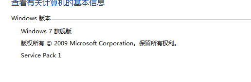

# to_do 何调试TIDB源码

后面调试，连接tikv，pd 可以连接服务器上的了，这个研究一下，

## 一、Centos

### 准备

1. 使用tiup 部署集群

~~~shell
cd /data/tidb/tiup
tiup cluster deploy tidb-test v4.0.0 ./topology1.yaml --user root -p ##部署
tiup cluster list ##查询

tiup cluster display tidb-test  ##查询
tiup cluster start tidb-test ##启动
tiup cluster start tidb-test  -R pd ## 单独启动
tiup cluster stop tidb-test

cd /data/tidb/tiup/tidb-deploy/tidb-4000/bin

## 对之前部署tidb-test集群进行参数 
tiup cluster edit-config  tidb-test
tiup cluster reload  tidb-test

# TiDB 集群可以在不中断线上服务的情况下进行扩容和缩容。
## 执行扩容命令  https://docs.pingcap.com/zh/tidb/dev/scale-tidb-using-tiup
tiup cluster scale-out tidb-test scale-out.yaml
ssh-keygen //设置 SSH 通过密钥登录

## 缩容 TiDB/PD/TiKV 节点 
画外音：配置太低，需要缩容

tiup cluster display  tidb-test
tiup cluster scale-in tidb-test --node 127.0.0.1:4001
提示：Scaled cluster `tidb-test` in successfully
查看 /data/tidb/tiup/tidb-deploy 目录 tidb-4001 已经被删除

https://asktug.com/t/topic/36950
~~~

2. 编译源码

~~~shell

### tidb
git clone https://github.com/pingcap/tidb.git
cd /data/tidb/src/github.com/pingcap/tidb
make

./tidb-server -V 
Release Version: v4.0.0-beta.2-949-g3f38fa5d0-dirty
Edition: Community
Git Commit Hash: 3f38fa5d02b618666efce714be129b1afacd582d
Git Branch: master

小王提问：
c++ 编译有 -g 调试模式，方便gdb调试,goalng deubg如何设置呢？

https://github.com/pingcap/tidb/blob/master/Makefile

~~~

3. 替换

~~~shell
###  Text file busy
cp /data/tidb/src/github.com/pingcap/tidb/bin/tidb-server  /data/tidb/tiup/tidb-deploy/tidb-4000/bin/tidb-server 

tiup cluster stop tidb-test
tiup cluster start tidb-test 
tiup cluster display tidb-test 
~~~

画外音：

> 这里做不到更新tidb-server版本时候平滑升级呀？，还需要停止原来的服务 .
>
> https://asktug.com/t/topic/36950
>
> https://asktug.com/t/topic/36090

### Centos

### 单元测试

https://asktug.com/t/topic/36997

如果不涉及 failpoint 的测试，可以

cd tidb/kv
go test -check.f TestBasicFunc

如果涉及 failpoint 的，可以

make failpoint-enable
cd tidb/kv
go test -check.f TestXXX
cd …

- 测试1-main函数

~~~
server:
ifeq ($(TARGET), "")
	CGO_ENABLED=1 $(GOBUILD) $(RACE_FLAG) -ldflags '$(LDFLAGS) $(CHECK_FLAG)' -o bin/tidb-server tidb-server/main.go
else
	CGO_ENABLED=1 $(GOBUILD) $(RACE_FLAG) -ldflags '$(LDFLAGS) $(CHECK_FLAG)' -o '$(TARGET)' tidb-server/main.go
endif
go test -check.f TestRunMain
atal error: runtime: out of memory
~~~

- 客户端命令

  ~~~mysql
  mysql -h 127.0.0.1 -P 4000 -u root  -p
  ~~~

  

## 二、Windows

- 单元测试

~~~
cd D:\money\src\github.com\wangcy6\tidb\executor
go test -check.f TestCastXXX //使用 go test -check.f $TEST_NAME 来指定测试用例

go test -check.f  TestAddExpressionIndex
### DDL
go test -check.f  testAddIndexWithPK
go test -check.f  testAddColumn

~~~

画外音

> 这个比较消耗内存，我2G 云主机根本无法运行，直接报错 fatal error: runtime: out of memory

> 需要设置http_proxy,多执行几次。

- vsocde 调试【该方法可以，我电脑配置不行放弃了 】

1. [安装PowerShell7](https://github.com/PowerShell/PowerShell/releases/tag/v7.0.0-preview.1) ，

   Get-Host | Select-Object Version 2.0

   

   

   

   需要Universal C Runtime (CRT) for Windows 7 --> Windows Management Framework (WMF) 5.0

   (fuck 公司破系统，看来自己购买好好机器 ，最后安装失败，window10内置)

   

Windows Management Framework 4.

https://docs.microsoft.com/en-us/powershell/scripting/windows-powershell/install/windows-powershell-system-requirements?view=powershell-7

https://docs.microsoft.com/zh-cn/powershell/scripting/windows-powershell/install/installing-windows-powershell?view=powershell-6

https://blog.csdn.net/clearloveq/article/details/81708655

画外音：

> 主要来自 https://github.com/pingcap/tidb/pull/19084的思路 ，我电脑有问题安装失败
>
> 放弃了。

## FQA

- https://pingcap.com/blog-cn/30mins-become-contributor-of-tikv/ 三十分钟成为 Contributor | 为 TiKV 添加 built-in 函数

- http://blog.minifish.org/posts/dlv/ --使用 delve 调试 Golang 程序

-  https://asktug.com/t/topic/37122/2

- https://juejin.im/post/6844903992552587272